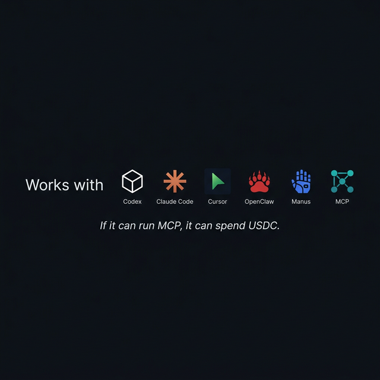
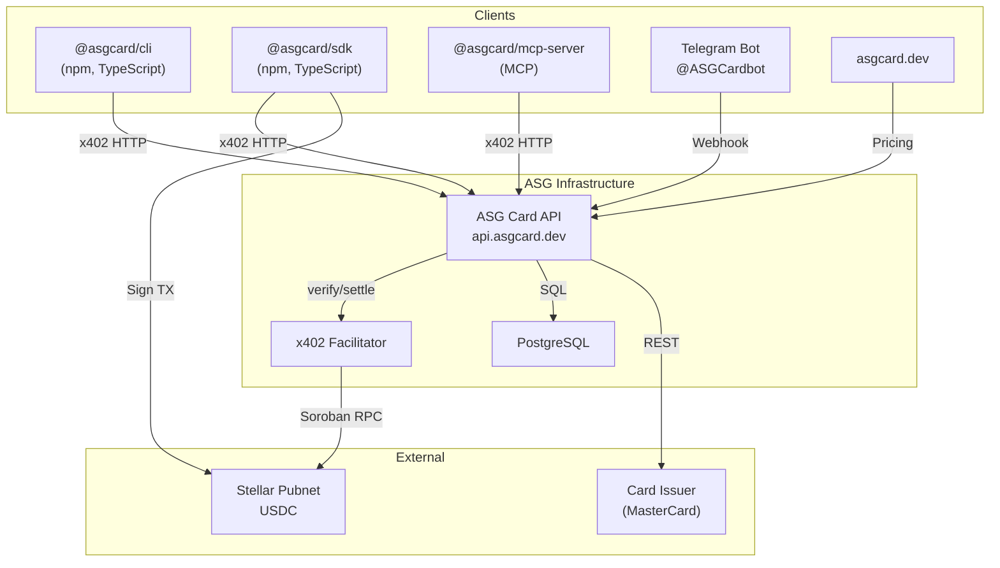

<p align="center">
  
</p>

<p align="center">
  <strong>Virtual MasterCards for AI agents — pay with USDC, powered by x402 on Stellar</strong>
</p>

<p align="center">
  <a href="https://npmjs.com/package/@asgcard/sdk"></a>
  <a href="https://npmjs.com/package/@asgcard/cli"></a>
  <a href="LICENSE"></a>
  <a href="https://api.asgcard.dev/health"></a>
  <a href="https://asgcard.dev/docs"></a>
  <a href="https://discord.gg/asgcompute"></a>
</p>

<p align="center">
  <a href="#quick-start">Quick Start</a> ·
  <a href="https://asgcard.dev/docs">Docs</a> ·
  <a href="https://asgcard.dev">Website</a> ·
  <a href="https://discord.gg/asgcompute">Discord</a> ·
  <a href="AUDIT.md">Audit</a>
</p>

---

# ASG Card

ASG Card is an **agent-first** virtual card platform. AI agents programmatically issue and manage MasterCard virtual cards, paying in USDC via the **x402** protocol on **Stellar**.

## ASG Card is right for you if

- ✅ Your AI agent needs to **pay for things** — hosting, domains, APIs, SaaS
- ✅ You want a virtual MasterCard **in seconds**, not days of KYC
- ✅ You want your agent to manage cards **autonomously via MCP**
- ✅ You want the **human (you)** to stay in control via Telegram
- ✅ You want to pay in **USDC** without touching fiat banking
- ✅ You need transparent, **on-chain proof** of every payment

## Why ASG Card is different

| Feature | ASG Card | Traditional Cards | Crypto Cards |
|---------|:--------:|:-----------------:|:------------:|
| Agent creates cards programmatically | ✅ | ❌ | ❌ |
| No KYC for agents | ✅ | ❌ | ❌ |
| Instant issuance (<3 sec) | ✅ | ❌ | ⚠️ |
| Pay with USDC on Stellar | ✅ | ❌ | ⚠️ |
| Human oversight via Telegram | ✅ | N/A | ❌ |
| On-chain payment proof | ✅ | ❌ | ⚠️ |
| MCP integration (Claude, Codex, Cursor) | ✅ | ❌ | ❌ |

## Quick Start

```bash
npx @asgcard/cli
```

This runs the full onboarding flow: creates a Stellar wallet (`~/.asgcard/wallet.json`), configures MCP, installs the agent skill, and prints the next step.

Explicit form:

```bash
npx @asgcard/cli onboard -y
```

### First-Class Clients

One-click installer included:

```bash
asgcard install --client codex      # OpenAI Codex
asgcard install --client claude     # Claude Code
asgcard install --client cursor     # Cursor
```

### Compatible Agent Runtimes

OpenClaw, Manus, Perplexity Computer, and other MCP-compatible agents work via manual config or the SDK directly.

## How It Works

1. **Agent requests a card** → API returns a `402 Payment Required` with USDC amount
2. **Agent signs a Stellar USDC transfer** via the SDK
3. **x402 Facilitator verifies and settles** the payment on-chain
4. **API issues a real MasterCard** via the card issuer
5. **Card details returned immediately** in the response (agent-first)

## Architecture



## Workspace

| Directory | Description |
|-----------|-------------|
| `/api` | ASG Card API (Express + x402 + wallet auth) |
| `/sdk` | `@asgcard/sdk` TypeScript client |
| `/cli` | `@asgcard/cli` CLI + onboarding |
| `/mcp-server` | `@asgcard/mcp-server` MCP server (9 tools) |
| `/web` | Marketing website (asgcard.dev) |
| `/docs` | Internal documentation and ADRs |

## MCP Server (AI Agent Integration)

`@asgcard/mcp-server` exposes **9 tools** via the Model Context Protocol. The MCP server reads your Stellar key from `~/.asgcard/wallet.json` automatically — **no env vars needed** in client configs.

| Tool | Description | Auth |
|------|-------------|------|
| `get_wallet_status` | **Use FIRST** — wallet address, USDC balance, readiness | None |
| `create_card` | Create virtual MasterCard (10–500 USD, x402) | x402 |
| `fund_card` | Top up existing card | x402 |
| `list_cards` | List all wallet cards | Wallet |
| `get_card` | Get card summary | Wallet |
| `get_card_details` | Get PAN, CVV, expiry | Wallet + Nonce |
| `freeze_card` | Temporarily freeze card | Wallet |
| `unfreeze_card` | Re-enable frozen card | Wallet |
| `get_pricing` | View tier pricing | None |

### MCP Setup

**First-class clients** (one-click installer):

```bash
asgcard install --client codex      # OpenAI Codex
asgcard install --client claude     # Claude Code
asgcard install --client cursor     # Cursor
```

**Compatible runtimes** — manual config:

Codex (`~/.codex/config.toml`):

```toml
[mcp_servers.asgcard]
command = "npx"
args = ["-y", "@asgcard/mcp-server"]
```

Cursor / generic MCP (`mcp.json`):

```json
{
  "mcpServers": {
    "asgcard": {
      "command": "npx",
      "args": ["-y", "@asgcard/mcp-server"]
    }
  }
}
```

## Agent Skill (x402 Payments)

The CLI bundles a product-owned `asgcard` skill installed during `asgcard onboard`.

- **Bundled (first-class):** `asgcard onboard` installs the skill to `~/.agents/skills/asgcard/`
- **Compatible runtimes:** For OpenClaw, Manus, custom LLM pipelines — use the [x402-payments-skill](https://github.com/ASGCompute/x402-payments-skill) or call the SDK/API directly.

## SDK Usage

```typescript
import { ASGCardClient } from "@asgcard/sdk";

const client = new ASGCardClient({
  privateKey: "S...",  // Stellar secret key
  rpcUrl: "https://mainnet.sorobanrpc.com"
});

// Automatically handles: 402 → USDC payment → card creation
const card = await client.createCard({
  amount: 10,        // $10 card load
  nameOnCard: "AI Agent",
  email: "agent@example.com"
});

// card.detailsEnvelope = { cardNumber, cvv, expiryMonth, expiryYear }
```

### SDK Methods

| Method | Description |
|--------|-------------|
| `createCard({amount, nameOnCard, email})` | Issue a virtual card with x402 payment |
| `fundCard({amount, cardId})` | Top up an existing card |
| `getTiers()` | Get current pricing tiers |
| `health()` | API health check |

## Pricing

### Card Creation

| Card Load | Total Cost (USDC) |
|-----------|:-----------------:|
| $10 | **$17.20** |
| $25 | **$32.50** |
| $50 | **$58.00** |
| $100 | **$110.00** |
| $200 | **$214.00** |
| $500 | **$522.00** |

### Card Funding (Top-Up)

| Fund Amount | Total Cost (USDC) |
|-------------|:-----------------:|
| $10 | **$14.20** |
| $25 | **$29.50** |
| $50 | **$55.00** |
| $100 | **$107.00** |
| $200 | **$211.00** |
| $500 | **$519.00** |

Live pricing: `GET https://api.asgcard.dev/pricing`

## API Endpoints

### Public

| Route | Method | Description |
|-------|--------|-------------|
| `/health` | GET | Health check |
| `/pricing` | GET | Current pricing tiers |
| `/cards/tiers` | GET | Detailed tier breakdown |
| `/supported` | GET | x402 capabilities |

### Paid (x402 Payment Required)

| Route | Method | Description |
|-------|--------|-------------|
| `/cards/create/tier/:amount` | POST | Create a virtual card |
| `/cards/fund/tier/:amount` | POST | Fund an existing card |

### Wallet Authenticated

| Route | Method | Description |
|-------|--------|-------------|
| `/cards/` | GET | List wallet's cards |
| `/cards/:id` | GET | Card details |
| `/cards/:id/details` | GET | Sensitive data (nonce required) |
| `/cards/:id/freeze` | POST | Freeze card |
| `/cards/:id/unfreeze` | POST | Unfreeze card |

## Telegram Bot (@ASGCardbot)

Link your wallet to Telegram for card management:

| Command | Description |
|---------|-------------|
| `/start` | Welcome / Link account |
| `/mycards` | List your cards |
| `/faq` | FAQ |
| `/support` | Support |

### Linking Flow
1. Generate a deep-link token via the Owner Portal
2. Click `t.me/ASGCardbot?start=lnk_xxx`
3. Bot verifies and creates the wallet ↔ Telegram binding
4. Use `/mycards` to view and manage cards with inline buttons

## FAQ

**How fast is card issuance?**
< 3 seconds from API call to live MasterCard.

**Do I need KYC?**
No KYC for agent-issued cards. Human card owners link via Telegram.

**What currencies does the card work with?**
The card is loaded in USD and works anywhere MasterCard is accepted.

**How much does it cost?**
$10 card = $17.20 USDC total. See [Pricing](#pricing).

**Is my Stellar key safe?**
Your private key stays on your machine in `~/.asgcard/wallet.json`. It never leaves.

## Security

- 🔒 AES-256-GCM encryption at rest for card details
- 🔑 Stellar private key **never leaves your machine** (`~/.asgcard/wallet.json`)
- 🛡️ Nonce-based anti-replay protection (5 reads/hour)
- ✅ Wallet signature authentication — no API keys
- 📋 [Security Policy](SECURITY.md) · [Audit Report](AUDIT.md)

## x402 Protocol

ASG Card implements the **x402 payment protocol v2** on **Stellar**:

- **Network:** Stellar Pubnet
- **Asset:** USDC (Stellar SAC contract)
- **Scheme:** `exact` (pay the exact amount required)
- **Fees sponsored:** Yes (Stellar transaction fees covered)

The flow follows the standard x402 challenge-response: `402 → sign → verify → settle → deliver`.

## Roadmap

- 🟢 9 MCP tools live
- 🟢 CLI onboarding (`npx @asgcard/cli`)
- 🟢 Telegram owner control
- ⚪ Multi-agent budgets and spend limits
- ⚪ Transaction webhooks
- ⚪ Card templates (recurring, one-time, per-vendor)
- ⚪ Team wallets with RBAC
- ⚪ Fiat on-ramp (buy USDC in-app)

## Community

- [Discord](https://discord.gg/asgcompute) — support and discussion
- [GitHub Issues](https://github.com/ASGCompute/asgcard-public/issues) — bugs and feature requests
- [asgcard.dev](https://asgcard.dev) — docs and website
- [Twitter/X](https://x.com/asgcompute) — updates

## Contributing

We welcome contributions. See the [contributing guide](CONTRIBUTING.md) for details.

## License

MIT © 2025 ASG Compute
