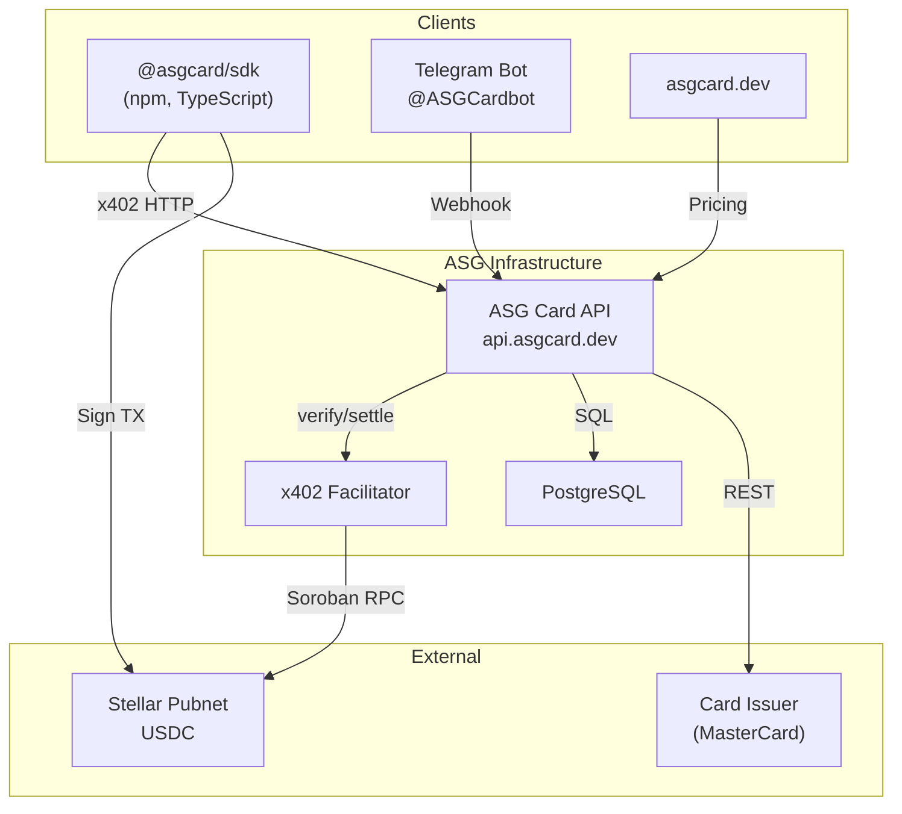

# ASG Card

ASG Card is an **agent-first** virtual card platform. AI agents programmatically issue and manage MasterCard virtual cards, paying in USDC via the **x402** protocol on **Stellar**.

## Architecture



## How It Works

1. **Agent requests a card** → API returns a `402 Payment Required` with USDC amount
2. **Agent signs a Stellar USDC transfer** via the SDK
3. **x402 Facilitator verifies and settles** the payment on-chain
4. **API issues a real MasterCard** via the card issuer
5. **Card details returned immediately** in the response (agent-first)

## Workspace

| Directory | Description |
|-----------|-------------|
| `/api` | ASG Card API (Express + x402 + wallet auth) |
| `/sdk` | `@asgcard/sdk` TypeScript client |
| `/cli` | `@asgcard/cli` CLI with onboarding |
| `/mcp-server` | `@asgcard/mcp-server` MCP server (11 tools) |
| `/web` | Marketing website (asgcard.dev) |
| `/docs` | Internal documentation and ADRs |
| `/stellar-mpp-payments-skill` | Community-facing Stellar MPP skill scaffold with installer, references, and examples |

## Quick Start — First Card

```bash
# One-step onboarding (creates wallet, configures MCP, installs skill)
npx @asgcard/cli onboard -y --client codex

# Fund your wallet with USDC on Stellar (address shown by onboard)
# Then:
npx @asgcard/cli card:create -a 10 -n "AI Agent" -e you@email.com
```

### Development

```bash
npm install
npm run dev:api   # API on localhost:3000
npm run dev       # Web on localhost:3001
```

## SDK Usage

```typescript
import { ASGCardClient } from "@asgcard/sdk";

const client = new ASGCardClient({
  privateKey: "S...",  // Stellar secret key
  rpcUrl: "https://mainnet.sorobanrpc.com"
});

// Automatically handles: 402 → USDC payment → card creation
const card = await client.createCard({
  amount: 10,        // $10 card load
  nameOnCard: "AI Agent",
  email: "agent@example.com"
});

// card.detailsEnvelope = { cardNumber, cvv, expiryMonth, expiryYear }
```

### SDK Methods

| Method | Description |
|--------|-------------|
| `createCard({amount, nameOnCard, email, phone?})` | Issue a virtual card with x402 payment |
| `fundCard({amount, cardId})` | Top up an existing card |
| `listCards()` | List all cards for this wallet |
| `getTransactions(cardId, page?, limit?)` | Get card transaction history |
| `getBalance(cardId)` | Get live card balance |
| `getPricing()` | Get current pricing |
| `health()` | API health check |

## MCP Server (AI Agent Integration)

`@asgcard/mcp-server` exposes **11 tools** for Codex, Claude Code, and Cursor:

| Tool | Description |
|------|-------------|
| `get_wallet_status` | **Use FIRST** — wallet address, USDC balance, readiness |
| `create_card` | Create virtual card (x402 payment) |
| `fund_card` | Fund existing card (x402 payment) |
| `list_cards` | List all wallet cards |
| `get_card` | Get card summary |
| `get_card_details` | Get PAN, CVV, expiry |
| `freeze_card` | Freeze a card |
| `unfreeze_card` | Unfreeze a card |
| `get_pricing` | View pricing |
| `get_transactions` | Card transaction history (real 4payments data) |
| `get_balance` | Live card balance from 4payments |

### MCP Setup

```bash
npx @asgcard/cli install --client codex    # or claude, cursor
```

## Agent Skill (x402 Payments)

The CLI bundles a product-owned `asgcard` skill that is installed automatically during `asgcard onboard` to `~/.agents/skills/asgcard/`.

For custom autonomous agents and raw LLM pipelines, the [x402-payments-skill](https://github.com/ASGCompute/x402-payments-skill) teaches agents how to pay via x402 natively on Stellar.

For MPP-specific community work, see `stellar-mpp-payments-skill/` in this repo. It mirrors the same distribution model with a dedicated `SKILL.md`, installer, and seller/client examples for Stellar MPP.

## Pricing

**Simple, transparent, no hidden fees.**

- **$10** one-time card issuance
- **3.5%** on every top-up

That's it. Load any amount from $5 to $5,000.

> Load $100 onto a new card → **$113.50 USDC**. Top up $200 later → just **$207 USDC**.

## API Endpoints

### Public

| Route | Method | Description |
|-------|--------|-------------|
| `/health` | GET | Health check |
| `/pricing` | GET | Pricing info |
| `/cards/tiers` | GET | Pricing info |
| `/supported` | GET | x402 capabilities |

### Paid (x402 Payment Required)

| Route | Method | Description |
|-------|--------|-------------|
| `/cards/create/tier/:amount` | POST | Create a virtual card |
| `/cards/fund/tier/:amount` | POST | Fund an existing card |

### Wallet Authenticated

| Route | Method | Description |
|-------|--------|-------------|
| `/cards/` | GET | List wallet's cards |
| `/cards/:id` | GET | Card details |
| `/cards/:id/details` | GET | Sensitive data (nonce required) |
| `/cards/:id/transactions` | GET | Card transaction history |
| `/cards/:id/balance` | GET | Live card balance |
| `/cards/:id/freeze` | POST | Freeze card |
| `/cards/:id/unfreeze` | POST | Unfreeze card |

## Telegram Bot (@ASGCardbot)

Link your wallet to Telegram for card management:

| Command | Description |
|---------|-------------|
| `/start` | Welcome / Link account |
| `/mycards` | List your cards |
| `/faq` | FAQ |
| `/support` | Support |

### Linking Flow
1. Generate a deep-link token via the Owner Portal
2. Click `t.me/ASGCardbot?start=lnk_xxx`
3. Bot verifies and creates the wallet ↔ Telegram binding
4. Use `/mycards` to view and manage cards with inline buttons

## x402 Protocol

ASG Card implements the **x402 payment protocol v2** on **Stellar**:

- **Network:** Stellar Pubnet
- **Asset:** USDC (Stellar SAC contract)
- **Scheme:** `exact` (pay the exact amount required)
- **Fees sponsored:** Yes (Stellar transaction fees covered)

The flow follows the standard x402 challenge-response: `402 → sign → verify → settle → deliver`.

## Security

- Card details encrypted at rest with **AES-256-GCM**
- Agent nonce-based anti-replay protection (5 reads/hour)
- Wallet signature authentication
- Telegram webhook secret validation
- Ops endpoints protected by API key + IP allowlist

## License

MIT
