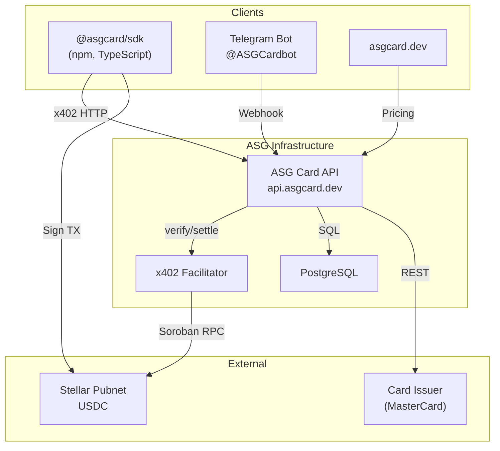

# ASG Card

ASG Card is an **agent-first** virtual card platform. AI agents programmatically issue and manage MasterCard virtual cards, paying in USDC via the **x402** protocol on **Stellar**.

## Architecture



## How It Works

1. **Agent requests a card** → API returns a `402 Payment Required` with USDC amount
2. **Agent signs a Stellar USDC transfer** via the SDK
3. **x402 Facilitator verifies and settles** the payment on-chain
4. **API issues a real MasterCard** via the card issuer
5. **Card details returned immediately** in the response (agent-first)

## Workspace

| Directory | Description |
|-----------|-------------|
| `/api` | ASG Card API (Express + x402 + wallet auth) |
| `/sdk` | `@asgcard/sdk` TypeScript client |
| `/mcp-server` | `@asgcard/mcp-server` MCP server for Claude, Cursor |
| `/web` | Marketing website (asgcard.dev) |
| `/docs` | Internal documentation and ADRs |

## Quick Start

```bash
npm install

# Terminal 1: API
npm run dev:api

# Terminal 2: Web
npm run dev
```

- API: `http://localhost:3000`
- Web: `http://localhost:3001`

## SDK Usage

```typescript
import { ASGCardClient } from "@asgcard/sdk";

const client = new ASGCardClient({
  privateKey: "S...",  // Stellar secret key
  rpcUrl: "https://mainnet.sorobanrpc.com"
});

// Automatically handles: 402 → USDC payment → card creation
const card = await client.createCard({
  amount: 10,        // $10 card load
  nameOnCard: "AI Agent",
  email: "agent@example.com"
});

// card.detailsEnvelope = { cardNumber, cvv, expiryMonth, expiryYear }
```

### SDK Methods

| Method | Description |
|--------|-------------|
| `createCard({amount, nameOnCard, email})` | Issue a virtual card with x402 payment |
| `fundCard({amount, cardId})` | Top up an existing card |
| `getTiers()` | Get current pricing tiers |
| `health()` | API health check |

## MCP Server (AI Agent Integration)

`@asgcard/mcp-server` exposes 8 tools for Claude Code, Claude Desktop, and Cursor:

| Tool | Description |
|------|-------------|
| `create_card` | Create a virtual card (x402 on-chain payment) |
| `fund_card` | Fund an existing card |
| `list_cards` | List all wallet cards |
| `get_card` | Get card summary |
| `get_card_details` | Get PAN, CVV, expiry |
| `freeze_card` | Temporarily freeze a card |
| `unfreeze_card` | Re-enable a frozen card |
| `get_pricing` | View tier pricing |

### Setup with Claude Code

```bash
claude mcp add asgcard -- npx -y @asgcard/mcp-server -e STELLAR_PRIVATE_KEY=S...
```

### Setup with Claude Desktop / Cursor

```json
{
  "mcpServers": {
    "asgcard": {
      "command": "npx",
      "args": ["-y", "@asgcard/mcp-server"],
      "env": {
        "STELLAR_PRIVATE_KEY": "YOUR_STELLAR_SECRET_KEY"
      }
    }
  }
}
```

## Pricing

### Card Creation

| Card Load | Total Cost (USDC) |
|-----------|:-----------------:|
| $10 | **$17.20** |
| $25 | **$32.50** |
| $50 | **$58.00** |
| $100 | **$110.00** |
| $200 | **$214.00** |
| $500 | **$522.00** |

### Card Funding (Top-Up)

| Fund Amount | Total Cost (USDC) |
|-------------|:-----------------:|
| $10 | **$14.20** |
| $25 | **$29.50** |
| $50 | **$55.00** |
| $100 | **$107.00** |
| $200 | **$211.00** |
| $500 | **$519.00** |

Live pricing: `GET https://api.asgcard.dev/pricing`

## API Endpoints

### Public

| Route | Method | Description |
|-------|--------|-------------|
| `/health` | GET | Health check |
| `/pricing` | GET | Current pricing tiers |
| `/cards/tiers` | GET | Detailed tier breakdown |
| `/supported` | GET | x402 capabilities |

### Paid (x402 Payment Required)

| Route | Method | Description |
|-------|--------|-------------|
| `/cards/create/tier/:amount` | POST | Create a virtual card |
| `/cards/fund/tier/:amount` | POST | Fund an existing card |

### Wallet Authenticated

| Route | Method | Description |
|-------|--------|-------------|
| `/cards/` | GET | List wallet's cards |
| `/cards/:id` | GET | Card details |
| `/cards/:id/details` | GET | Sensitive data (nonce required) |
| `/cards/:id/freeze` | POST | Freeze card |
| `/cards/:id/unfreeze` | POST | Unfreeze card |

## Telegram Bot (@ASGCardbot)

Link your wallet to Telegram for card management:

| Command | Description |
|---------|-------------|
| `/start` | Welcome / Link account |
| `/mycards` | List your cards |
| `/faq` | FAQ |
| `/support` | Support |

### Linking Flow
1. Generate a deep-link token via the Owner Portal
2. Click `t.me/ASGCardbot?start=lnk_xxx`
3. Bot verifies and creates the wallet ↔ Telegram binding
4. Use `/mycards` to view and manage cards with inline buttons

## x402 Protocol

ASG Card implements the **x402 payment protocol v2** on **Stellar**:

- **Network:** Stellar Pubnet
- **Asset:** USDC (Stellar SAC contract)
- **Scheme:** `exact` (pay the exact amount required)
- **Fees sponsored:** Yes (Stellar transaction fees covered)

The flow follows the standard x402 challenge-response: `402 → sign → verify → settle → deliver`.

## Security

- Card details encrypted at rest with **AES-256-GCM**
- Agent nonce-based anti-replay protection (5 reads/hour)
- Wallet signature authentication
- Telegram webhook secret validation
- Ops endpoints protected by API key + IP allowlist

## License

MIT
