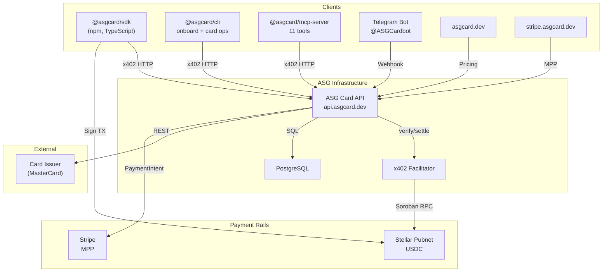

# ASG Card

ASG Card is an **agent-first** virtual card platform. AI agents programmatically issue and manage MasterCard virtual cards, paying via **Stellar x402** (USDC) or **Stripe Machine Payments Protocol** (card).

## Architecture



## Payment Rails

ASG Card supports two payment rails. The card product is identical — only the payment method differs.

### Stellar Edition (x402)

1. **Agent requests a card** → API returns `402 Payment Required` with USDC amount
2. **Agent signs a Stellar USDC transfer** via the SDK
3. **x402 Facilitator verifies and settles** the payment on-chain
4. **API issues a MasterCard** via the card issuer
5. **Card details returned immediately** in the response

Uses: SDK, CLI, MCP server. No human in the loop.

### Stripe Edition (MPP)

1. **Agent creates a payment request** → API returns `approval_required` + `approvalUrl`
2. **Owner opens the approval page** at `stripe.asgcard.dev/approve`
3. **Owner reviews and approves** → Stripe Elements form with real-time pricing
4. **Owner pays via Stripe** → card/Apple Pay/Google Pay
5. **Card created** → agent polls until `completed`

Uses: session-based auth (`X-STRIPE-SESSION`). Human-in-the-loop approval.

## Workspace

| Directory | Description |
|-----------|-------------|
| `/api` | ASG Card API (Express + x402 + Stripe MPP) |
| `/sdk` | `@asgcard/sdk` TypeScript client |
| `/cli` | `@asgcard/cli` CLI with onboarding |
| `/mcp-server` | `@asgcard/mcp-server` MCP server (11 tools) |
| `/web` | Marketing website (asgcard.dev) |
| `/web-stripe` | Stripe edition site (stripe.asgcard.dev) |
| `/docs` | Internal documentation and ADRs |

## Quick Start — First Card

```bash
# One-step onboarding (creates wallet, configures MCP, installs skill)
npx @asgcard/cli onboard -y --client codex

# Fund your wallet with USDC on Stellar (address shown by onboard)
# Then:
npx @asgcard/cli card:create -a 10 -n "AI Agent" -e you@email.com
```

## SDK Usage

```typescript
import { ASGCardClient } from "@asgcard/sdk";

const client = new ASGCardClient({
  privateKey: "S...",  // Stellar secret key
  rpcUrl: "https://mainnet.sorobanrpc.com"
});

// Automatically handles: 402 → USDC payment → card creation
const card = await client.createCard({
  amount: 10,        // $10 card load
  nameOnCard: "AI Agent",
  email: "agent@example.com"
});

// card.detailsEnvelope = { cardNumber, cvv, expiryMonth, expiryYear }
```

### SDK Methods

| Method | Description |
|--------|-------------|
| `createCard({amount, nameOnCard, email, phone?})` | Issue a virtual card with x402 payment |
| `fundCard({amount, cardId})` | Top up an existing card |
| `listCards()` | List all cards for this wallet |
| `getTransactions(cardId, page?, limit?)` | Get card transaction history |
| `getBalance(cardId)` | Get live card balance |
| `getPricing()` | Get current pricing |
| `health()` | API health check |

## MCP Server (AI Agent Integration)

`@asgcard/mcp-server` exposes **11 tools** for Codex, Claude Code, and Cursor:

| Tool | Description |
|------|-------------|
| `get_wallet_status` | **Use FIRST** — wallet address, USDC balance, readiness |
| `create_card` | Create virtual card (x402 payment) |
| `fund_card` | Fund existing card (x402 payment) |
| `list_cards` | List all wallet cards |
| `get_card` | Get card summary |
| `get_card_details` | Get PAN, CVV, expiry |
| `freeze_card` | Freeze a card |
| `unfreeze_card` | Unfreeze a card |
| `get_pricing` | View pricing |
| `get_transactions` | Card transaction history (real 4payments data) |
| `get_balance` | Live card balance from 4payments |

### MCP Setup

```bash
npx @asgcard/cli install --client codex    # or claude, cursor
```

## Pricing

**Simple, transparent, no hidden fees.**

- **$10** one-time card issuance
- **3.5%** on every top-up

That's it. Load any amount from $5 to $5,000.

> Load $100 onto a new card → **$113.50** total. Top up $200 later → just **$207**.
> Same pricing on both Stellar and Stripe rails.

## API Endpoints

### Public

| Route | Method | Description |
|-------|--------|-------------|
| `/health` | GET | Health check |
| `/pricing` | GET | Pricing info |
| `/cards/tiers` | GET | Pricing info |
| `/supported` | GET | x402 capabilities |

### Stellar x402 (Payment Required)

| Route | Method | Description |
|-------|--------|-------------|
| `/cards/create/tier/:amount` | POST | Create a virtual card |
| `/cards/fund/tier/:amount` | POST | Fund an existing card |

### Wallet Authenticated

| Route | Method | Description |
|-------|--------|-------------|
| `/cards/` | GET | List wallet's cards |
| `/cards/:id` | GET | Card details |
| `/cards/:id/details` | GET | Sensitive data (nonce required) |
| `/cards/:id/transactions` | GET | Card transaction history |
| `/cards/:id/balance` | GET | Live card balance |
| `/cards/:id/freeze` | POST | Freeze card |
| `/cards/:id/unfreeze` | POST | Unfreeze card |

### Stripe MPP (Beta)

| Route | Method | Description |
|-------|--------|-------------|
| `/stripe-beta/session` | POST | Create managed session |
| `/stripe-beta/payment-requests` | POST | Create payment request |
| `/stripe-beta/payment-requests/:id` | GET | Poll request status |
| `/stripe-beta/approve/:id` | GET/POST | Approval page data / approve or reject |
| `/stripe-beta/approve/:id/complete` | POST | Complete payment (MPP credential) |
| `/stripe-beta/cards` | GET | List session's cards |
| `/stripe-beta/cards/:id/details` | GET | Card details (nonce required) |

## Telegram Bot (@ASGCardbot)

Link your wallet to Telegram for card management:

| Command | Description |
|---------|-------------|
| `/start` | Welcome / Link account |
| `/mycards` | List your cards |
| `/faq` | FAQ |
| `/support` | Support |

## Security

- Card details encrypted at rest with **AES-256-GCM**
- Agent nonce-based anti-replay protection (5 reads/hour)
- Wallet signature authentication (Stellar edition)
- Session-based authentication with beta gates (Stripe edition)
- Stripe session keys redacted from logs
- Telegram webhook secret validation
- Ops endpoints protected by API key + IP allowlist

## License

MIT
