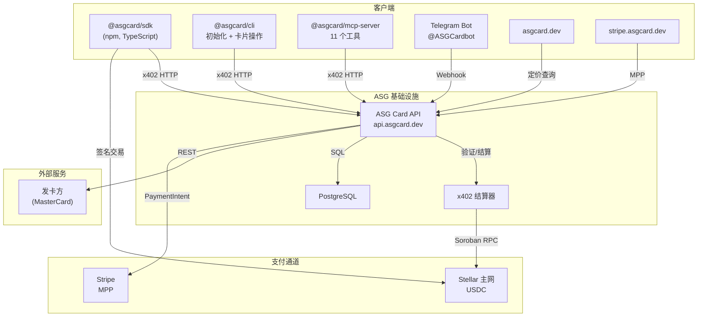

<p align="center">
  <h1 align="center">ASG Card</h1>
  <p align="center">
    <strong>你的 AI 智能体需要一张信用卡。ASG Card 让它在几秒内通过编程方式获得一张 — 支持 USDC 或 Stripe 支付。</strong>
  </p>
</p>

<p align="center">
  <a href="https://www.npmjs.com/package/@asgcard/sdk"></a>
  <a href="https://www.npmjs.com/package/@asgcard/cli"></a>
  <a href="https://www.npmjs.com/package/@asgcard/mcp-server"></a>
  <br />
  <a href="https://www.npmjs.com/package/@asgcard/sdk"></a>
  <a href="https://www.npmjs.com/package/@asgcard/cli"></a>
  <a href="https://www.npmjs.com/package/@asgcard/mcp-server"></a>
  <br />
  <a href="https://github.com/ASGCompute/asgcard/blob/main/LICENSE"></a>
  <a href="https://asgcard.dev"></a>
</p>

<p align="center">
  🌐 <a href="README.md">English</a> | <a href="README.zh-CN.md">中文</a>
</p>

---

**ASG Card** 是一个 **AI 智能体优先** 的虚拟卡平台。AI 智能体可以通过编程方式发行和管理 MasterCard 虚拟卡，支持 **Stellar x402**（USDC 链上支付）或 **Stripe 机器支付协议**（传统卡支付）两种支付通道。

## 快速开始 — 创建第一张卡

```bash
# 一键初始化（创建钱包、配置 MCP、安装 skill）
npx @asgcard/cli onboard -y --client codex

# 使用 USDC 在 Stellar 上为钱包充值（地址由 onboard 命令显示）
# 然后：
npx @asgcard/cli card:create -a 10 -n "AI Agent" -e you@email.com
```

## SDK 使用方式

```typescript
import { ASGCardClient } from "@asgcard/sdk";

const client = new ASGCardClient({
  privateKey: "S...",  // Stellar 私钥
  rpcUrl: "https://mainnet.sorobanrpc.com"
});

// 自动处理：402 → USDC 支付 → 卡片创建
const card = await client.createCard({
  amount: 10,        // $10 充值金额
  nameOnCard: "AI Agent",
  email: "agent@example.com"
});

// card.detailsEnvelope = { cardNumber, cvv, expiryMonth, expiryYear }
```

### SDK 方法

| 方法 | 描述 |
|------|------|
| `createCard({amount, nameOnCard, email, phone?})` | 通过 x402 支付发行虚拟卡 |
| `fundCard({amount, cardId})` | 为现有卡片充值 |
| `listCards()` | 列出该钱包的所有卡片 |
| `getTransactions(cardId, page?, limit?)` | 获取卡片交易记录 |
| `getBalance(cardId)` | 获取实时卡片余额 |
| `getPricing()` | 获取当前定价 |
| `health()` | API 健康检查 |

## MCP 服务器（AI 智能体集成）

`@asgcard/mcp-server` 为 Codex、Claude Code 和 Cursor 提供 **11 个工具**：

| 工具 | 描述 |
|------|------|
| `get_wallet_status` | **首先使用** — 钱包地址、USDC 余额、就绪状态 |
| `create_card` | 创建虚拟卡（x402 支付） |
| `fund_card` | 为现有卡充值（x402 支付） |
| `list_cards` | 列出所有钱包卡片 |
| `get_card` | 获取卡片摘要 |
| `get_card_details` | 获取卡号、CVV、有效期 |
| `freeze_card` | 冻结卡片 |
| `unfreeze_card` | 解冻卡片 |
| `get_pricing` | 查看定价 |
| `get_transactions` | 卡片交易历史（真实数据） |
| `get_balance` | 实时卡片余额 |

### MCP 配置

```bash
npx @asgcard/cli install --client codex    # 或 claude、cursor
```

## 系统架构



## 支付通道

ASG Card 支持两种支付通道。卡片产品完全相同 — 仅支付方式不同。

### Stellar 版本（x402）

1. **智能体请求创建卡片** → API 返回 `402 Payment Required` 及 USDC 金额
2. **智能体通过 SDK 签署 Stellar USDC 转账**
3. **x402 结算器验证并结算** 链上支付
4. **API 通过发卡方发行 MasterCard**
5. **卡片详情立即返回** 在响应中

使用方式：SDK、CLI、MCP 服务器。全程无需人工参与。

### Stripe 版本（MPP）

1. **智能体创建支付请求** → API 返回 `approval_required` + `approvalUrl`
2. **所有者打开审批页面** `stripe.asgcard.dev/approve`
3. **所有者审核并批准** → Stripe Elements 表单，实时定价
4. **所有者通过 Stripe 支付** → 支持信用卡/Apple Pay/Google Pay
5. **卡片创建完成** → 智能体轮询至 `completed`

使用方式：基于会话认证（`X-STRIPE-SESSION`）。需要人工审批。

## 项目结构

| 目录 | 描述 |
|------|------|
| `/api` | ASG Card API（Express + x402 + Stripe MPP） |
| `/sdk` | `@asgcard/sdk` TypeScript 客户端 |
| `/cli` | `@asgcard/cli` 命令行工具 |
| `/mcp-server` | `@asgcard/mcp-server` MCP 服务器（11 个工具） |
| `/web` | 营销网站（asgcard.dev） |
| `/web-stripe` | Stripe 版本网站（stripe.asgcard.dev） |
| `/docs` | 内部文档和架构决策记录 |

## 定价

**简单透明，无隐藏费用。**

- **$10** 一次性卡片创建费（无需初始充值）
- **3.5%** 每次充值手续费

充值范围：$5 至 $5,000。

> 仅创建卡片 → **$10**。创建并充值 $100 → **$113.50**。之后充值 $200 → **$207**。
> Stellar 和 Stripe 通道定价完全一致。

## 安全性

- 卡片详情使用 **AES-256-GCM** 加密存储
- 基于 Nonce 的智能体防重放保护（每小时 5 次）
- 钱包签名认证（Stellar 版本）
- 基于会话的认证，具备 Beta 门控（Stripe 版本）
- Stripe 会话密钥在日志中自动脱敏
- Telegram Webhook 密钥验证
- 运维接口受 API 密钥 + IP 白名单保护

## 参与贡献

欢迎贡献！请查看 [CONTRIBUTING.md](CONTRIBUTING.md) 了解贡献指南，浏览标记为 [`good first issue`](https://github.com/ASGCompute/asgcard/labels/good%20first%20issue) 的问题快速上手。

本项目遵循 [行为准则](CODE_OF_CONDUCT.md)。

## 许可证

MIT

---

<p align="center">
  <a href="https://star-history.com/#ASGCompute/asgcard&Date">
    
  </a>
</p>
