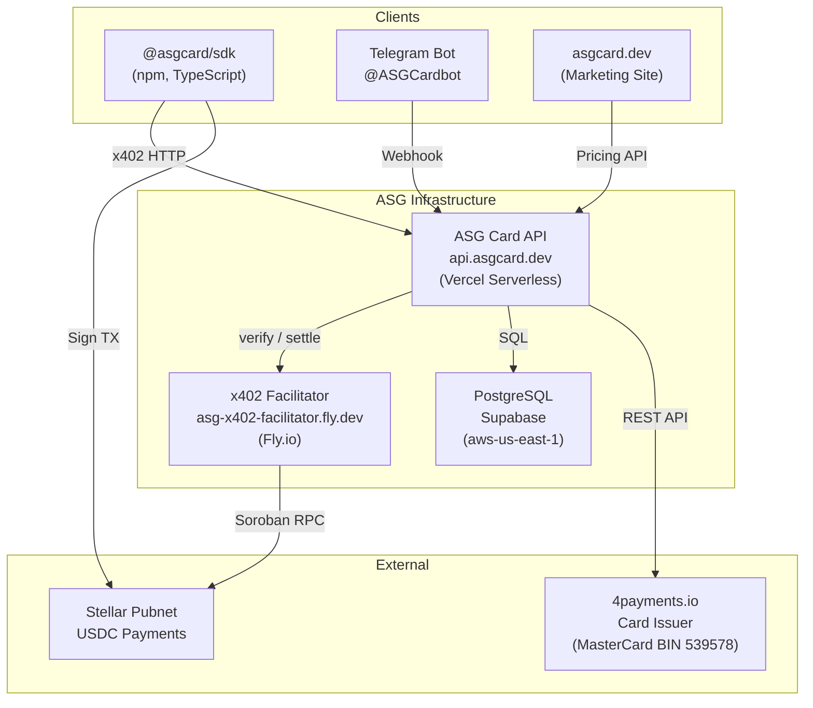
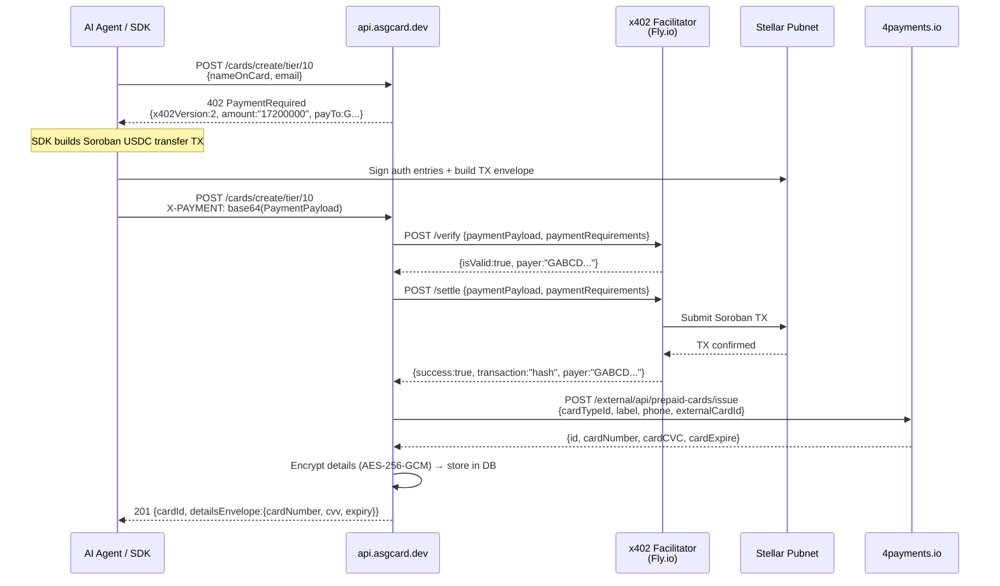

# ASG Card — Полная Архитектура (INTERNAL / CONFIDENTIAL)

> ⚠️ **Внутренний документ.** Не публиковать. Содержит API ключи, URL провайдеров, внутренние детали.

## 1. Обзор

ASG Card — это **agent-first** платформа виртуальных карт, где AI-агенты могут программно выпускать и управлять MasterCard виртуальными картами, оплачивая в USDC через протокол **x402** на блокчейне **Stellar**.



---

## 2. Сервисы и Развёртывание

| Сервис | URL | Платформа | Назначение |
|--------|-----|-----------|------------|
| **API** | `api.asgcard.dev` | Vercel (Serverless) | Основной бэкенд, x402 middleware, карточные операции |
| **x402 Facilitator** | `asg-x402-facilitator.fly.dev` | Fly.io | Верификация и сеттлмент Stellar USDC платежей |
| **Database** | `ptnyqylyvjcbvxmyardw.supabase.com` | Supabase (AWS us-east-1) | PostgreSQL: cards, payments, telegram links, audit |
| **Website** | `asgcard.dev` | Vercel | Маркетинговый сайт + документация |
| **Card Issuer** | `business.4payments.io` | 4payments.io | MasterCard выпуск, пополнение, freeze/unfreeze |
| **Telegram Bot** | `@ASGCardbot` | Telegram API | Управление картами через бот |
| **SDK** | `@asgcard/sdk` (npm) | npm registry | TypeScript SDK для агентов |
| **GitHub** | `ASGCompute/asgcard` | GitHub (private) | Исходный код (monorepo) |

### Facilitator Details
- **Signer key:** `GDOE3GMALJR7IHPFZL3AMTRYJBOCIWHS6ZZF3VFMQMACFSQECFZGAJDD`
- **Treasury (payTo):** `GAHYHA55RTD2J4LAVJILTNHWMF2H2YVK5QXLQT3CHCJSVET3VRWPOCW6`
- **x402 v2, scheme=exact, network=stellar:pubnet, areFeesSponsored=true**

---

## 3. x402 Payment Flow



### x402 параметры
- **x402Version:** 2 | **scheme:** exact | **network:** stellar:pubnet
- **maxTimeoutSeconds:** 300 | **areFeesSponsored:** true
- **Retries:** verify — 2× (1s, 3s) | settle — 5× (2s, 4s, 8s, 16s, 30s)
- **Timeout:** 8s per request

---

## 4. Комиссии

### Создание карты

| Загрузка | Issuance | Top-Up | Наша | **Итого** |
|----------|:--------:|:------:|:----:|:---------:|
| $10 | $3.00 | $2.20 | $2.00 | **$17.20** |
| $25 | $3.00 | $2.50 | $2.00 | **$32.50** |
| $50 | $3.00 | $3.00 | $2.00 | **$58.00** |
| $100 | $3.00 | $4.00 | $3.00 | **$110.00** |
| $200 | $3.00 | $6.00 | $5.00 | **$214.00** |
| $500 | $3.00 | $12.00 | $7.00 | **$522.00** |

### Пополнение

| Сумма | Top-Up | Наша | **Итого** |
|-------|:------:|:----:|:---------:|
| $10 | $2.20 | $2.00 | **$14.20** |
| $25 | $2.50 | $2.00 | **$29.50** |
| $50 | $3.00 | $2.00 | **$55.00** |
| $100 | $4.00 | $3.00 | **$107.00** |
| $200 | $6.00 | $5.00 | **$211.00** |
| $500 | $12.00 | $7.00 | **$519.00** |

> **Issuance Fee** ($3) — 4payments за выпуск (BIN 539578 MasterCard)
> **Top-Up Fee** — 4payments за пополнение
> **Наша (Service Fee)** — маржа ASG Card

---

## 5. Agent-First модель

Карта создаётся **программно** через SDK. AI-агент получает полные реквизиты в ответе.

```typescript
import { ASGCardClient } from "@asgcard/sdk";

const client = new ASGCardClient({
  privateKey: "S...",
  rpcUrl: "https://mainnet.sorobanrpc.com"
});

const card = await client.createCard({
  amount: 10,
  nameOnCard: "AI Agent",
  email: "agent@example.com"
});
// card.detailsEnvelope = { cardNumber, cvv, expiryMonth, expiryYear }
```

| SDK метод | Описание |
|-----------|----------|
| `createCard()` | Выпуск + x402 оплата |
| `fundCard()` | Пополнение + x402 оплата |
| `getTiers()` | Актуальные тарифы |
| `health()` | Health check |

### Details Envelope
При создании детали возвращаются **сразу** (`oneTimeAccess: true, expiresInSeconds: 300`).  
Повторный доступ: `GET /cards/:id/details` с `X-AGENT-NONCE` (anti-replay, 5/час).

---

## 6. 4payments Integration (CONFIDENTIAL)

- **Provider:** 4payments.io (Card-as-a-Service)
- **Dashboard:** `business.4payments.io`
- **Docs:** `docs.4payments.io`
- **Auth:** `Bearer <FOURPAYMENTS_API_TOKEN>`
- **Card Type ID:** `69a0b7debf6e6610138bba2c`
- **BIN:** 539578 (MasterCard) | **Currency:** USD

### API Endpoints

| Операция | Метод | Path |
|----------|-------|------|
| Выпуск | POST | `/external/api/prepaid-cards/issue` |
| Детали | GET | `/external/api/prepaid-cards/{id}` |
| Чувств. данные | GET | `/external/api/prepaid-cards/{id}/sensetive` |
| Пополнение | POST | `/external/api/prepaid-cards/{id}/topup` |
| Заморозка | POST | `/external/api/prepaid-cards/{id}/freeze` |
| Разморозка | POST | `/external/api/prepaid-cards/{id}/unfreeze` |

### Текущие реальные карты в 4payments

| 4payments ID | Last 4 | Balance | externalCardId | В нашей БД |
|-------------|--------|---------|----------------|------------|
| `69b1db9d...b60` | 0519 | $3 | test_verify_phone_456 | ❌ нет |
| `69b1dcb3...bcc` | 8816 | $10 | asg_1773264047115_hif7z0 | ✅ card_c787ef22 |
| `69b1dcda...c19` | 5603 | $10 | asg_1773264086348_kfcimt | ✅ card_f9be5261 |

> ⚠️ Карта `69b1db9d` (****0519) создана через прямой curl тест и НЕ привязана к нашей БД.

---

## 7. API Route Map

### Public (anonymous)
| Route | Method | Описание |
|-------|--------|----------|
| `/health` | GET | Health check |
| `/pricing` | GET | Тарифы |
| `/cards/tiers` | GET | Детальные тарифы |
| `/supported` | GET | x402 capabilities |

### Paid (x402)
| Route | Method | Описание |
|-------|--------|----------|
| `/cards/create/tier/:amount` | POST | Создать карту |
| `/cards/fund/tier/:amount` | POST | Пополнить |

### Wallet Auth
| Route | Method | Описание |
|-------|--------|----------|
| `/cards/` | GET | Список карт |
| `/cards/:id` | GET | Детали |
| `/cards/:id/details` | GET | Реквизиты (nonce) |
| `/cards/:id/freeze` | POST | Заморозить |
| `/cards/:id/unfreeze` | POST | Разморозить |

### Bot / Portal / Ops
| Route | Method | Описание |
|-------|--------|----------|
| `/bot/telegram/webhook` | POST | TG webhook |
| `/bot/telegram/setup` | POST | Register webhook |
| `/portal/telegram/link-token` | POST | Generate link |
| `/portal/telegram/revoke` | POST | Unlink |
| `/ops/stats` | GET | Stats |

---

## 8. Telegram Bot

### Привязка аккаунта
1. Owner → `POST /portal/telegram/link-token` → deep-link `t.me/ASGCardbot?start=lnk_xxx`
2. User кликает → бот получает `/start lnk_xxx` → `consumeToken()` → binding в `owner_telegram_links`

### Команды
`/start` — Welcome/Link | `/mycards` — Список карт | `/faq` — FAQ | `/support` — Поддержка

### Inline кнопки
❄️ Freeze / 🔓 Unfreeze | 👁 Reveal | 📄 Statement

---

## 9. Database (Supabase PostgreSQL)

| Таблица | Назначение |
|---------|------------|
| `cards` | card_id, wallet, balance, status, details_encrypted, four_payments_id |
| `payments` | tx_hash, payer, amount, tier, purpose |
| `owner_telegram_links` | telegram_user_id, chat_id, owner_wallet, status |
| `telegram_link_tokens` | token_hash, expires_at, status |
| `agent_nonces` | nonce, wallet, card_id (anti-replay) |
| `audit_log` | actor, action, decision, ip |

Шифрование: **AES-256-GCM** (key: `CARD_DETAILS_KEY`, base64 32 bytes).

---

## 10. Environment Variables

| Variable | Purpose |
|----------|---------|
| `DATABASE_URL` | Supabase Postgres |
| `CARD_DETAILS_KEY` | AES-256-GCM encryption key |
| `STELLAR_NETWORK` | `stellar:pubnet` |
| `STELLAR_TREASURY_ADDRESS` | `GAHYHA55...POCW6` |
| `STELLAR_USDC_ASSET` | `CCW67T...SJMI75` |
| `FACILITATOR_URL` | `https://asg-x402-facilitator.fly.dev` |
| `FACILITATOR_API_KEY` | Bearer token |
| `FOURPAYMENTS_API_TOKEN` | 4payments Bearer token |
| `FOURPAYMENTS_BASE_URL` | `https://business.4payments.io` |
| `FOURPAYMENTS_CARD_TYPE_ID` | `69a0b7debf6e6610138bba2c` |
| `TG_BOT_TOKEN` | @ASGCardbot token |
| `TG_WEBHOOK_SECRET` | Webhook validation |
| `WEBHOOK_SECRET` | HMAC for payment webhooks |
| `OPS_API_KEY` | Ops dashboard auth |
