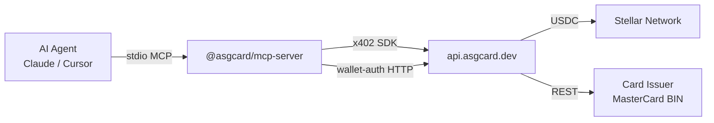

# ASG Card — MCP Server Documentation

> MCP (Model Context Protocol) сервер позволяет AI-агентам (Claude Code, Claude Desktop, Cursor) управлять виртуальными картами через стандартный MCP интерфейс.

## Обзор

`@asgcard/mcp-server` — npm пакет, предоставляющий 11 MCP tools для:
- Создания и пополнения карт (x402, автономно, без человека)
- Управления картами (список, детали, freeze/unfreeze)
- Просмотра истории транзакций и баланса (реальные данные 4payments)
- Просмотра тарифов



## MCP Tools (11)

| Tool | Params | Транспорт | Описание |
|------|--------|-----------|----------|
| `get_wallet_status` | — | public + Horizon | Статус кошелька, баланс USDC, готовность |
| `create_card` | amount, nameOnCard, email | x402 SDK | Создать карту + оплата USDC on-chain |
| `fund_card` | amount, cardId | x402 SDK | Пополнить карту |
| `list_cards` | — | wallet-auth | Список всех карт кошелька |
| `get_card` | cardId | wallet-auth | Сводка по карте (баланс, статус) |
| `get_card_details` | cardId | wallet-auth | PAN, CVV, expiry (чувствительные) |
| `freeze_card` | cardId | wallet-auth | Заморозить карту |
| `unfreeze_card` | cardId | wallet-auth | Разморозить |
| `get_pricing` | — | public API | Тарифы и цены |
| `get_transactions` | cardId, page?, limit? | wallet-auth | История транзакций с 4payments |
| `get_balance` | cardId | wallet-auth | Живой баланс карты из 4payments |


## Архитектура

### Три типа вызовов:

1. **x402 SDK** (`create_card`, `fund_card`):
   - Используют `ASGCardClient` из `@asgcard/sdk`
   - Автоматический flow: 402 → sign USDC TX → submit → card created
   - Stellar Keypair подписывает транзакцию

2. **Wallet-auth** (`list_cards`, `get_card`, `get_card_details`, `freeze_card`, `unfreeze_card`, `get_transactions`, `get_balance`):
   - Прямые HTTP вызовы к API
   - Auth headers: `X-WALLET-ADDRESS`, `X-WALLET-SIGNATURE`, `X-WALLET-TIMESTAMP`
   - Подпись: `ed25519(asgcard-auth:{timestamp})`, base64

3. **Public** (`get_wallet_status`, `get_pricing`):
   - Прямые HTTP вызовы без аутентификации

### Безопасность:
- Stellar private key **не покидает** локальный процесс
- Все ed25519 подписи с 5-min timestamp window
- Card details зашифрованы AES-256-GCM at rest

## Установка

### Из npm (продакшн):
```bash
npx @asgcard/mcp-server
```

### Из исходников:
```bash
cd mcp-server
npm install && npm run build
STELLAR_PRIVATE_KEY=S... node dist/index.js
```

## Конфигурация MCP клиентов

### Claude Code:
```bash
claude mcp add asgcard -- npx -y @asgcard/mcp-server -e STELLAR_PRIVATE_KEY=S...
```

### Claude Desktop / Cursor:
```json
{
  "mcpServers": {
    "asgcard": {
      "command": "npx",
      "args": ["-y", "@asgcard/mcp-server"],
      "env": {
        "STELLAR_PRIVATE_KEY": "S..."
      }
    }
  }
}
```

## Env Vars

| Variable | Required | Default | Description |
|----------|----------|---------|-------------|
| `STELLAR_PRIVATE_KEY` | ✅ | — | Stellar secret key (S...) |
| `ASGCARD_API_URL` | ❌ | `https://api.asgcard.dev` | API endpoint |
| `STELLAR_RPC_URL` | ❌ | `https://mainnet.sorobanrpc.com` | Soroban RPC |

## Файловая структура

```
mcp-server/
├── package.json        # @asgcard/mcp-server
├── tsconfig.json       # ES2022 + Node16
├── src/
│   ├── index.ts        # Entry point (stdio transport)
│   ├── server.ts       # MCP server factory (11 tools)
│   └── wallet-client.ts # Wallet-auth HTTP client
└── dist/               # Compiled output
```

